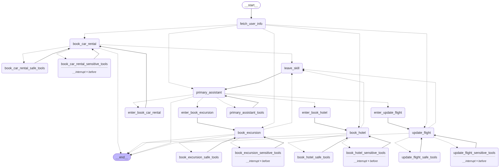

# Legacy: Multi-Agent RAG Customer Support System

> This is the previous app (`customer_support_chat/`, Streamlit UI). It is being replaced by
> the AI Travel Platform described in the [README](../README.md) and is removed in phase 11.
> Its commands below are run from the repository root.

An AI customer-support assistant for an airline (Swiss Airlines demo data). A
customer can ask policy questions, look up their bookings, and change or book
flights, hotels, car rentals and excursions in natural language.

- **Multi-agent orchestration** with LangGraph: a primary assistant routes each
  request to a flight, hotel, car-rental or excursion specialist.
- **Retrieval-augmented generation (RAG)** over a policy knowledge base, with
  reranking, a relevance threshold and **source citations**. When the documents
  don't answer a question, the assistant says so instead of inventing a policy.
- **Tools** for live, customer-specific data (bookings in a SQLite travel database).
- **Human-in-the-loop safety**: every booking, change or cancellation is
  previewed and only executed after the customer confirms.
- **Product shell**: FastAPI backend, Streamlit chat UI, sign-in, structured
  logging, clean error handling and a test suite.



---

## Architecture

```text
                         ┌─────────────┐
                         │    USER     │
                         └──────┬──────┘
                                ▼
                     ┌────────────────────┐
                     │  STREAMLIT CHAT UI │  streamlit_app.py
                     └─────────┬──────────┘
                               ▼  HTTP (JSON)
                     ┌────────────────────┐
                     │   FASTAPI BACKEND  │  app/api.py: auth, validation, timeouts, errors
                     │    CHAT SERVICE    │  app/services/chat_service.py: sessions, confirmations
                     └─────────┬──────────┘
                               ▼
                     ┌────────────────────┐
                     │ LANGGRAPH (graph.py)│  checkpointed per conversation
                     │  fetch_user_info   │
                     └─────────┬──────────┘
                               ▼
                     ┌────────────────────┐
                     │ PRIMARY ASSISTANT  │
                     └─────────┬──────────┘
         ┌───────────────┬─────┴─────────┬────────────────┐
         ▼               ▼               ▼                ▼
      FLIGHT        CAR RENTAL         HOTEL          EXCURSION      specialists
         └───────────────┴──────┬────────┴────────────────┘
                 ┌──────────────┴───────────────┐
                 ▼                              ▼
          RAG: lookup_policy               TOOLS (SQLite)
          embed → Qdrant → rerank          safe: search / read
          → threshold → sources            sensitive: book / change / cancel
                 │                          ⏸ interrupt → customer confirms
                 └──────────────┬───────────────┘
                                ▼
                       GEMINI (LLM) RESPONSE
                                ▼
                    answer + sources + agent → UI
```

### Multi-agent graph

| Node | Role |
|---|---|
| `fetch_user_info` | Loads the signed-in customer's tickets every turn. Guests get a "not signed in" context instead of an error. Then routes to the **active** assistant (`route_to_workflow`), so follow-up answers go straight to the specialist that asked. |
| `primary_assistant` | Answers policy questions (RAG) and questions about the customer's own flights, and delegates actions through `ToFlightBookingAssistant`, `ToBookCarRental`, `ToHotelBookingAssistant` and `ToBookExcursion`. |
| `update_flight`, `book_car_rental`, `book_hotel`, `book_excursion` | Specialists with their own prompt and tools. Each can also call `lookup_policy` to answer combined RAG + booking questions. |
| `*_safe_tools` / `*_sensitive_tools` | Tool nodes. Sensitive nodes are compiled with `interrupt_before`, so the graph pauses until the customer confirms. |
| `leave_skill` | When a specialist calls `CompleteOrEscalate`, this pops the dialog stack and hands control back to the primary assistant. |

### RAG vs tools

| Question type | Source | Example |
|---|---|---|
| Policy / general knowledge | **RAG** (`lookup_policy`) | "What is the baggage policy?" |
| Customer-specific data | **Tools / database** | "Show me my flight", "Book the Hilton" |
| Both | **RAG + booking data** | "Can I cancel my flight and what refund would I get?" combines the customer's fare class from the database with the cancellation policy |

RAG is a tool the model calls only when needed; it does not run on every message.

### RAG pipeline

```text
knowledge_base/*.md ─► load ─► clean ─► split by "##" section ─► chunk (900/120)
   ─► embed (all-MiniLM-L6-v2, 384-d) ─► Qdrant collection "knowledge_base_collection"

query ─► embed ─► top-12 candidates ─► cross-encoder rerank (ms-marco-MiniLM-L-6-v2)
      ─► drop scores < RAG_MIN_SCORE (0.2) ─► top-4 chunks ─► LLM context + sources
```

Every chunk stores `source`, `document_name`, `section`, `chunk_id`, `category` and
`last_updated`. The API returns these as `sources`, and the UI shows them under
each answer. If nothing passes the threshold, the tool returns
`NO_RELEVANT_POLICY_FOUND` and the assistant tells the customer it could not
verify the answer.

Measured on the real index: relevant questions score 0.36 to 1.0 after reranking,
while off-topic questions ("capital of France", "crypto payments", "emotional
support peacocks") score at most 0.002.

---

## Project structure

```text
customer_support_chat/
  app/
    api.py                 FastAPI app (auth, chat, confirm, health)
    graph.py               LangGraph multi-agent graph (build_graph / get_graph)
    main.py                Terminal client
    core/                  settings, structured logging, typed errors, state
    services/
      chat_service.py      sessions, conversation ownership, confirmation flow
      rag.py               retrieval + reranking + threshold
      assistants/          primary + 4 specialist assistants
      tools/               flights, hotels, cars, excursions, lookup_policy
  data/                    travel2.sqlite + local Qdrant store (generated, git-ignored)
vectorizer/                ingestion package: Qdrant client, embeddings, knowledge loader
knowledge_base/            policy & FAQ documents (Markdown)
scripts/                   ingest.py, smoke_test.py, reset_demo_data.py
tests/                     unit, tool, RAG, graph-flow and API tests
streamlit_app.py           chat UI (API client)
```

---

## Setup

Requirements: **Python 3.12**. A GPU is not needed; embeddings and reranking run on CPU.

```bash
# Poetry
poetry install

# or pip
python -m venv .venv && .venv\Scripts\activate   # macOS/Linux: source .venv/bin/activate
pip install -r requirements.txt
```

### Environment variables

Copy `.env.example` to `.env` and set at least `GEMINI_API_KEY`.

| Variable | Default | Purpose |
|---|---|---|
| `GEMINI_API_KEY` | - | **Required.** Google AI Studio key |
| `GEMINI_MODEL` | `gemini-3.5-flash-lite` | Chat model (see *Model choice*) |
| `LLM_TEMPERATURE` / `LLM_TIMEOUT_SECONDS` / `LLM_MAX_RETRIES` | `0.2` / `60` / `2` | LLM behaviour |
| `SQLITE_DB_PATH` | `./customer_support_chat/data/travel2.sqlite` | Travel database |
| `KNOWLEDGE_BASE_DIR` | `./knowledge_base` | Policy documents |
| `QDRANT_PATH` | `./customer_support_chat/data/qdrant_local` | Embedded vector store (no server) |
| `QDRANT_URL` / `QDRANT_API_KEY` | - | Use a Qdrant server instead (overrides `QDRANT_PATH`) |
| `RAG_TOP_K` / `RAG_CANDIDATES` / `RAG_RERANK` / `RAG_MIN_SCORE` | `4` / `12` / `true` / `0.2` | Retrieval tuning |
| `API_HOST` / `API_PORT` / `API_URL` | `127.0.0.1` / `8000` / `http://127.0.0.1:8000` | Backend address |
| `CORS_ORIGINS` | `http://localhost:8501,...` | Allowed browser origins |
| `REQUEST_TIMEOUT_SECONDS` / `SESSION_TTL_MINUTES` | `120` / `120` | Request timeout, session lifetime |
| `LOGIN_MAX_ATTEMPTS` / `LOGIN_LOCKOUT_MINUTES` | `5` / `15` | Failed sign-ins allowed per passenger ID before a temporary lockout |
| `DEMO_PASSENGER_ID` | - | Development only: pre-fills the sign-in form |
| `LOG_LEVEL` / `LOG_FORMAT` | `INFO` / `text` | `LOG_FORMAT=json` for log aggregation |
| `HF_TOKEN` | - | Optional, raises Hugging Face download limits |
| `LANGSMITH_TRACING` / `LANGSMITH_API_KEY` | `false` / - | Optional tracing. Only enabled when both are set; the app never depends on it. |

`.env` is git-ignored. Never commit real keys.

---

## Running locally

```bash
# 1. Ingestion (one-off, and again whenever knowledge_base/ changes)
python scripts/ingest.py                         # downloads the travel DB, builds all collections (~10 min on CPU)
python scripts/ingest.py --only knowledge_base   # only re-index the policy documents (~30 s)

# 2. Backend
python -m customer_support_chat.app.api          # http://127.0.0.1:8000  (docs: /docs)

# 3. Frontend (second terminal)
streamlit run streamlit_app.py                   # http://localhost:8501
```

The app reads the existing index and never rebuilds it at startup.
With embedded Qdrant only **one process** can open the store, so **stop the API
before running ingestion**, or use a Qdrant server via `QDRANT_URL`.

Terminal client (no UI): `python -m customer_support_chat.app.main`

### Demo account

Sign in with a passenger ID and booking reference (or ticket number) from the
travel database. The dates are shifted to "now" at download time. A passenger with
an upcoming flight works best:

| Passenger ID | Booking reference | Flight |
|---|---|---|
| `3369 995465` | `904C29` | DL0042 BSL → HAM, Economy |

Demo bookings change the database. Run `python scripts/reset_demo_data.py` (with the API
stopped) to restore it.

### API

| Method | Path | Body | Notes |
|---|---|---|---|
| `POST` | `/auth/login` | `{passenger_id, booking_reference}` | Returns `session_token` (send as `Authorization: Bearer ...`) |
| `POST` | `/auth/logout` | - | |
| `POST` | `/chat` | `{conversation_id?, message}` | Works signed in or as a guest (policy questions only) |
| `POST` | `/chat/confirm` | `{conversation_id, approved, reason?}` | Approves or declines a pending sensitive action |
| `GET` | `/health` | - | `ok` / `degraded` with LLM, database and knowledge-base checks |

```json
{
  "conversation_id": "2f9c...",
  "response": "Economy Classic tickets are refundable minus a CHF 150 fee...",
  "sources": [{"document_name": "Flight Cancellation and Refund Policy",
               "section": "Cancellation fees by fare type",
               "source": "flights/cancellation_and_refund_policy.md",
               "chunk_id": "cancellation-and-refund-policy#cancellation-fees-by-fare-type-0",
               "score": 0.999}],
  "agent": "Customer Support",
  "status": "success",
  "pending_actions": []
}
```

When a sensitive tool is about to run, `status` is `confirmation_required` and
`pending_actions` lists e.g. `{"title": "Change your flight", "details": [...]}`.
Sending a new message instead of confirming counts as declining, and the
customer's message is passed to the assistant as the reason.

Errors never include tracebacks:
`{"status": "error", "error": {"code": "not_authenticated", "message": "We couldn't identify your customer account. ..."}}`.
The codes are `invalid_request` (422), `not_authenticated` (401), `conversation_not_found` (404),
`no_pending_action` / `conversation_busy` (409), `rate_limited` / `too_many_attempts` (429),
`assistant_unavailable` / `service_unavailable` (503), `timeout` (504) and `internal_error` (500).

---

## Testing

```bash
python -m pytest                 # 87 tests, no API key or network needed (~1 min)
```

The tests use a scripted fake LLM, a fixture database and a temporary embedded
Qdrant holding the **real** knowledge base and models:

- **Unit:** dialog-state reducer, routing functions, assistant retry cap, formatting, settings, log masking
- **Tools:** flight info, structured search, rebooking rules (3-hour limit, same route, single leg of multi-leg tickets, unknown flight, other customer's ticket), cancel, new flight bookings, hotel/car/excursion CRUD
- **RAG:** loader metadata, known / unknown / irrelevant questions, source attribution, missing-index fallback
- **Graph flows:** primary → flight / car / hotel / excursion, hybrid RAG + booking, approve and decline sensitive actions, escalation back to the primary assistant, guest behaviour
- **Service:** sign-in lockout, cleanup of idle conversations and their graph history
- **API:** login, chat, confirm, conversation ownership, validation, LLM failure, rate limit, timeout, health

### End-to-end smoke test (real LLM)

With the API running:

```bash
python scripts/smoke_test.py --pause 30    # --pause spaces scenarios for free-tier rate limits
```

It drives the journeys over HTTP and checks each outcome. Result with
`gemini-3.5-flash-lite`: **8/8 passed**.

| # | Scenario | Path observed |
|---|---|---|
| 1 | "What is the baggage policy?" | Primary → RAG → answer + *Baggage Policy* source |
| 1b | "Do you allow emotional support peacocks?" | RAG finds nothing → "I could not verify..." (no invented policy) |
| 2 | "Show me my flight information." | Booking data → DL0042 BSL → HAM, seat, fare |
| 3 | "Change my flight to an earlier one on 13 October" | Flight specialist → search → policy → **confirm** → ticket updated |
| 4 | "Book a hotel in Basel for 2 nights" | Hotel specialist → search → **confirm** → booked |
| 5 | "I need a rental car in Basel" | Car specialist → search → **confirm** → booked |
| 6 | "Recommend an excursion in Basel" | Excursion specialist → options → **confirm** → booked |
| 7 | "Can I cancel my flight, and what refund will I get?" | Booking data (Economy) + RAG (refund policy) → "refundable minus CHF 150", with sources |

---

## Example conversation

```text
Customer:  Can I cancel my flight, and what refund will I get?
Assistant: Your ticket (DL0042, BSL → HAM on 16 Oct) is in Economy, which corresponds to
           Economy Classic. Economy Classic tickets are refundable minus a cancellation fee
           of CHF 150 per passenger and direction...
           Sources: Flight Cancellation and Refund Policy

Customer:  Please cancel my flight ticket.
Assistant: [Flight Support] Please review the action below and confirm whether I should go ahead.
           🔒 Cancel your flight ticket. Ticket no: 0060005432262957      [Confirm] [Decline]
Customer:  (Decline)
Assistant: The cancellation was declined. Your ticket remains active and has not been cancelled.
```

---

## Model choice

The original code used `gemini-2.5-flash`, which Google no longer offers to new API
users (404 "no longer available to new users"). The default is now
**`gemini-3.5-flash-lite`**:

- It passed all 8 end-to-end scenarios, including multi-step tool calling,
  routing and confirmations.
- On the free tier it has much higher limits than the larger Flash models
  (for example, `gemini-3.8-flash` allows about 20 requests per day). One conversation turn can take
  **3 to 6 LLM calls** (routing, tool use, answer).

Free-tier keys are still limited to about **15 requests per minute**. When the limit is hit,
the API returns `rate_limited` (429) with a "please wait a minute" message.
Change `GEMINI_MODEL` to switch models. Run `python scripts/smoke_test.py` after switching.

---

## Configuration notes and fixes

- **`Key 'title'/'default'/'anyOf' is not supported in schema` warnings** came from
  `langchain-google-genai` < 4. It stripped `anyOf`, so `Optional[...]` tool
  arguments lost their types. Pinning `langchain-google-genai >= 4.4` fixes the conversion.
- **LangSmith** is optional and off by default, so there are no 401 upload errors without a key.
- **Hugging Face**: set `HF_TOKEN` to remove the "unauthenticated requests" notice. It isn't required.
- **Passenger identity**: tools read `config["configurable"]["passenger_id"]`, which the
  API sets from the signed-in session. It is never hard-coded and never taken from the model.
- **Knowledge base safety**: the upstream SWISS FAQ ends with a third-party SEO
  article containing an unofficial phone number. That section is excluded from the knowledge base.

---

## Deployment

### Docker Compose

```bash
cp .env.example .env              # set GEMINI_API_KEY
docker compose up -d qdrant
docker compose run --rm ingest    # build the vector index into the Qdrant server
docker compose up -d api ui       # UI: http://localhost:8501, API: http://localhost:8000
```

Compose runs Qdrant as a server (`QDRANT_URL`), so ingestion and the API can run at
the same time. *The Docker setup has not been tested on the development machine yet
(Docker was not installed). Please verify before relying on it.*

### Production checklist

- Run the API with several workers behind a reverse proxy with TLS, and restrict `CORS_ORIGINS`.
- Replace `MemorySaver` and the in-memory session store with persistent ones
  (`build_graph(checkpointer=...)`, e.g. a Postgres or Redis LangGraph checkpointer).
  Currently a restart clears conversations and sessions.
- Use a Qdrant server or Qdrant Cloud (embedded mode warns above about 20k points; the
  flights collection has about 50k).
- Use a paid Gemini tier, or add request rate limiting per customer.
- Ship JSON logs (`LOG_FORMAT=json`) to your log stack and enable LangSmith if needed.

The original AWS reference architecture is in [`images/multi_agent_rag_system_architecture_aws.png`](../images/multi_agent_rag_system_architecture_aws.png).

---

## Known limitations

- **Demo data**: the travel DB is the public LangGraph tutorial dataset. Hotel,
  car and excursion inventories are global (a `booked` flag, not per customer),
  and they only cover Swiss cities.
- **Policy documents**: apart from the SWISS FAQ, the files in `knowledge_base/`
  are **demo policies written for this project**, not official airline policy.
- **Sign-in** checks a passenger ID plus booking reference against the database;
  there is no password or identity-provider integration.
- **State** (conversations, sessions) is in memory, so it is lost on restart and only
  works with a single API worker.
- **Free-tier LLM limits** restrict how many conversations can run per minute and per day.
- A timed-out request returns an error to the customer, but the graph may still
  finish in the background.
- Flight search across ~33k flights uses structured SQL filters. Free-text flight
  search uses vector similarity and is approximate.
